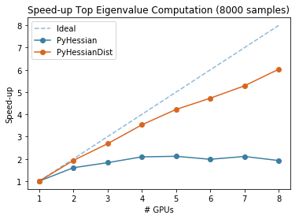
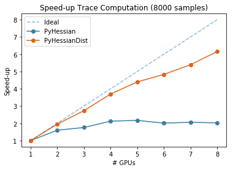
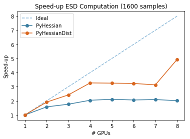

## Introduction
PyHessian is a pytorch library for Hessian based analysis of neural network models. The library supports computation of (i) top Hessian eigenvalues, (ii) the trace of the Hessian matrix, and (iii) the full Hessian Eigenvalues Spectral Density (ESD). For details please see [this paper](https://arxiv.org/pdf/1912.07145.pdf).


However, PyHessian library currently uses PyTorch's DataParallel for distributed memory computation which is 
inefficient due to high communication latency and lack of parallelization. The performance of this
implementation doesn't scales up. Hence, we provide PyHessianDist as an alternative for efficient distributed
memory computation. 

    

## Usage
Please first clone the PyHessian library to your local system:
```
git clone https://github.com/singhsarvagya/PyHessianDist.git
```

Before running the Hessian code, we need a (pre-trained) NN model. Here, we provide a training file to train ResNet20 model on Cifar-10 dataset:
```
export CUDA_VISIBLE_DEVICES=0; python training.py [--batch-size] [--test-batch-size] [--epochs] [--lr] [--lr-decay] [--lr-decay-epoch] [--seed] [--weight-decay] [--batch-norm] [--residual] [--cuda] [--saving-folder]

optional arguments:
--batch-size                training batch size (default: 128)
--test-batch-size           testing batch size (default:256)
--epochs                    total number of training epochs (default: 180)
--lr                        initial learning rate (default: 0.1)
--lr-decay                  learning rate decay ratio (default: 0.1)
--lr-decay-epoch            epoch for the learning rate decaying (default: 80, 120)
--seed                      used to reproduce the results (default: 1)
--weight-decay              weight decay value (default: 5e-4)
--batch-norm                do we need batch norm in ResNet or not (default: True)
--residual                  do we need residual connection or not (default: True)
--cuda                      do we use gpu or not (default: True)
--saving-folder             saving path of the final checkpoint (default: checkpoints/)
```

After the model checkpoint is saved, we can run the following code to get the top eigenvalue, trace, and the Eigenvalue Spectral Density of Hessian:
```
export CUDA_VISIBLE_DEVICES=0; python example_pyhessian_analysis.py [--mini-hessian-batch-size] [--hessian-batch-size] [--seed] [--batch-norm] [--residual] [--cuda] [--resume]
required arguments: 
--resume                    resume path of the checkpoint
--ip                        ip address of the machine to set up communication backend for distributed computation
--device_count              number of available GPUs 

optional arguments:
--mini-hessian-batch-size   mini hessian batch size (default: 200)
--hessian-batch-size        hessian batch size (default:200)
--seed                      used to reproduce the results (default: 1)
--batch-norm                do we need batch norm in ResNet or not (default: True)
--residual                  do we need residual connection or not (default: True)
--cuda                      do we use gpu or not (default: True)
--eigenvalue                to calculate top eigenvalue of the hessian 
--trace                     to calculate trace of the hessian 
--density                   to calculate esd of the hessian 
```

The output density plot is saved as example.pdf 

## Citing this work

If you find this repo useful and would like to cite it in a publication, here is a BibTeX entry:

```
@misc{pyhessian-dist,
    author       = {Sarvagya Vatsal Singh and Purva Gupta},
    title        = {PyHessianDist: PyHessian alternative for efficient distributed memory computation},
    month        = may,
    year         = 2020,
    version      = {1.0},
    url          = {https://github.com/singhsarvagya/PyHessianDist.git}
    }
```

## References 
* Z. Yao, A. Gholami, K Keutzer, M. Mahoney. PyHessian:  Neural Networks Through the Lens of the Hessian, under review [PDF](https://arxiv.org/pdf/1912.07145.pdf).


